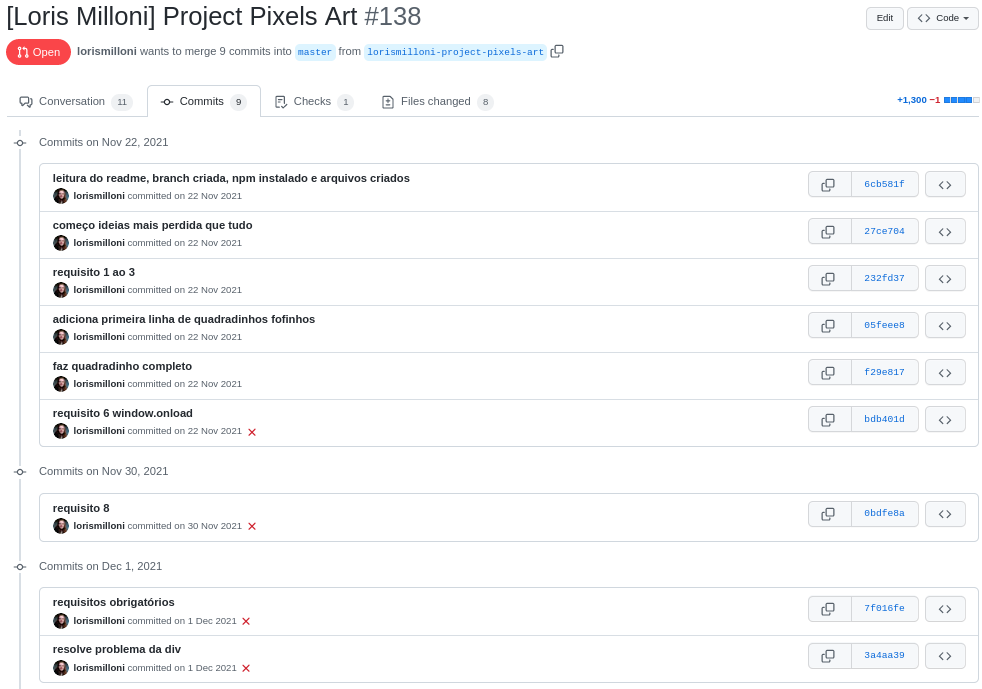
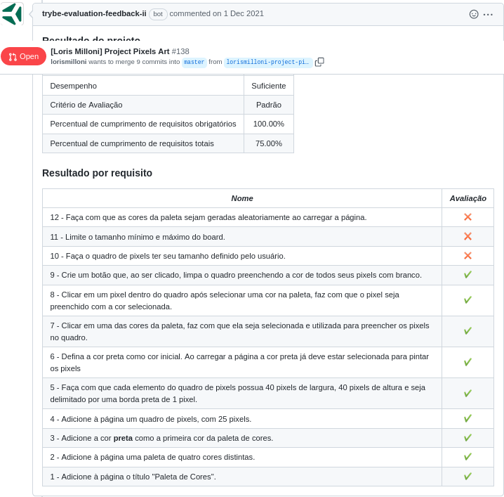

# study-project-pixels-art
Made in **01/12/2021**.

## In this Trybe assignment I learned how to manipulate DOM with JavaScript.
#### A web page was created with a functional color palette that can be used to create drawings with the pixels that I made, using JavaScript, HTML e CSS.
  
#### You can see my web site in [this link](https://lorismilloni.github.io/study-project-pixels-art/).

#### Trybe has a private repository with files that can't be shared. So here is my commit history print:

#### Here is the Trybe Evaluator

